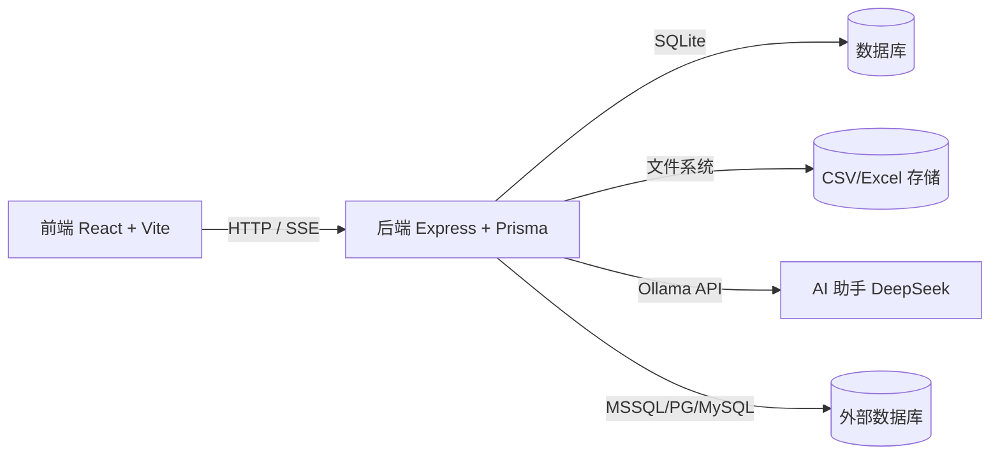
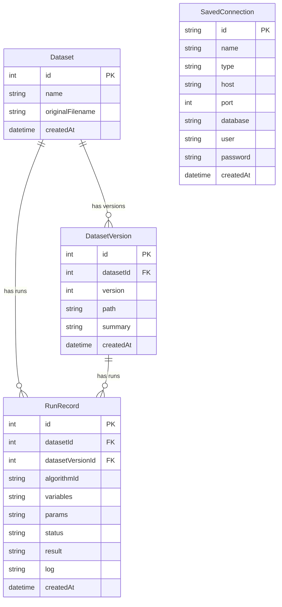
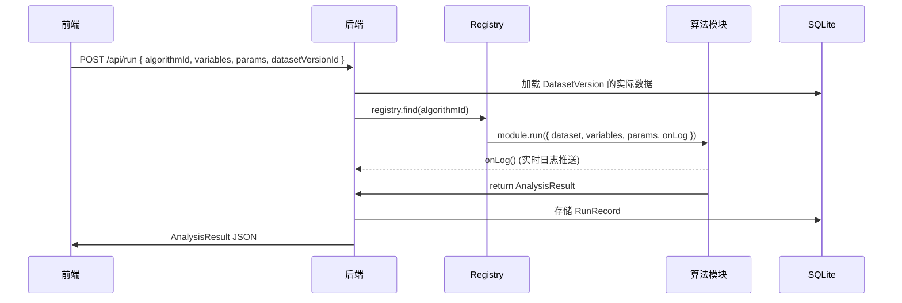
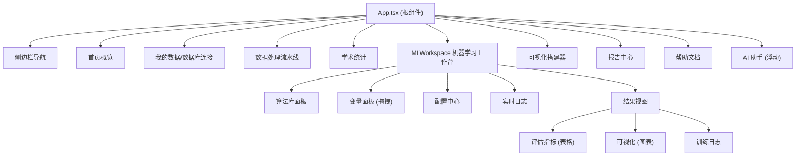
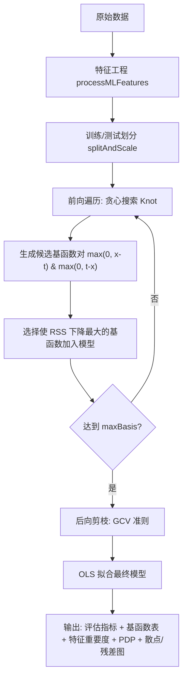

# StatLab 技术文档

> **版本**: v0.1.0 &nbsp;|&nbsp; **更新日期**: 2026-03-09 &nbsp;|&nbsp; **架构**: Monorepo (npm workspaces)

---

## 目录

1. [系统概览](#1-系统概览)
2. [项目结构](#2-项目结构)
3. [技术栈](#3-技术栈)
4. [数据库设计](#4-数据库设计)
5. [后端 API](#5-后端-api)
6. [算法引擎](#6-算法引擎)
7. [前端架构](#7-前端架构)
8. [UI 设计系统](#8-ui-设计系统)
9. [算法详解](#9-算法详解)
10. [开发与部署](#10-开发与部署)

---

## 1. 系统概览

StatLab 是一个面向制造业的**全栈数据分析平台**，专为工艺参数优化、质量诊断和统计建模设计。



### 核心能力

| 模块 | 说明 |
|------|------|
| 📊 数据管理 | CSV/Excel 上传、版本控制、外部数据库连接（MSSQL、PostgreSQL、MySQL） |
| 📈 学术统计 | 描述统计、相关分析、t 检验、ANOVA、卡方、EFA、正态性检验等 15 种算法 |
| 🤖 机器学习 | 回归（OLS、Ridge、Lasso、XGBoost、LightGBM、MARS）、分类（Logistic、决策树、随机森林）、聚类（KMeans+PCA） |
| 🩺 工业诊断 | 多参数影响分析、关联规则挖掘（FP-Growth）、最大信息系数（MIC） |
| 🧠 AI 助手 | 基于 Ollama/DeepSeek 的智能解读与交互式问答 |
| 📋 报告中心 | 历史运行记录查看、模型导入/导出 |

---

## 2. 项目结构

```
data platform/
├── package.json              # Monorepo 根配置 (npm workspaces)
├── client/                   # 前端 (React + Vite + TypeScript)
│   └── src/
│       ├── App.tsx           # 主应用组件 (~3000 行)
│       ├── MLWorkspace.tsx   # 机器学习工作台 (~1200 行)
│       ├── ChartBuilder.tsx  # 可视化搭建器
│       ├── DataProcessBuilder.tsx  # 数据处理流水线
│       ├── DbConnect.tsx     # 数据库连接管理
│       ├── AiAssistant.tsx   # AI 助手面板
│       └── styles.css        # 全局样式 (Apple-inspired, ~4200 行)
├── server/                   # 后端 (Express + TypeScript)
│   ├── src/
│   │   ├── index.ts          # API 路由 + 服务启动 (~1200 行)
│   │   └── predict.ts        # 批量预测服务
│   ├── analysis/
│   │   ├── registry.ts       # 算法注册中心
│   │   ├── utils.ts          # 公共工具 (特征工程、缩放、统计函数)
│   │   └── modules/          # 32 个算法模块
│   ├── prisma/
│   │   └── schema.prisma     # 数据库模型定义
│   └── db/                   # SQLite 数据库文件
├── shared/                   # 共享类型定义
│   └── src/index.ts          # TypeScript 接口定义
└── samples/                  # 预置示例数据集
```

---

## 3. 技术栈

### 前端

| 技术 | 版本 | 用途 |
|------|------|------|
| React | 18 | UI 框架 |
| Vite | 5 | 构建工具 + 热更新 |
| TypeScript | 5.4 | 类型安全 |
| ECharts | 5 | 图表渲染 |
| @dnd-kit | 6 | 拖拽交互（变量分配） |
| Axios | 1.x | HTTP 客户端 |
| Lucide | — | 图标库 |

### 后端

| 技术 | 版本 | 用途 |
|------|------|------|
| Express | 4.19 | HTTP 服务器 |
| Prisma | 5.11 | ORM + 数据库迁移 |
| SQLite | — | 本地数据库 |
| ts-node-dev | 2 | 开发热重载 |
| simple-statistics | 7.8 | 统计计算 |
| ml-random-forest | 2 | 随机森林 |
| ml-cart | 2.1 | 决策树（CART） |
| ml-matrix | 6.11 | 矩阵运算 |
| ml-logistic-regression | 2 | Logistic 回归 |
| ml-kmeans | 4 | K-Means 聚类 |
| node-fpgrowth | 1.2 | FP-Growth 频繁项集 |
| mssql / pg / mysql2 | — | 外部数据库驱动 |
| Zod | 3.22 | 请求校验 |

---

## 4. 数据库设计

使用 SQLite（Prisma ORM），数据模型如下：



> [!NOTE]
> `RunRecord.result` 和 `RunRecord.variables` 以 JSON 字符串形式存储。`SavedConnection.password` 使用 CryptoJS 加密。

---

## 5. 后端 API

API 基础路径: `http://localhost:3001`

### 核心端点

| 方法 | 路径 | 说明 |
|------|------|------|
| `GET` | `/health` | 健康检查 |
| `GET` | `/api/algorithms` | 获取所有算法 Spec（从 registry 动态生成） |
| `GET` | `/api/datasets` | 获取数据集列表 |
| `POST` | `/api/datasets/upload` | 上传 CSV/Excel 文件 |
| `POST` | `/api/datasets/import-sample/:name` | 导入预置样本数据 |
| `GET` | `/api/datasets/version/:id` | 获取特定版本元信息 |
| `GET` | `/api/datasets/version/:id/full-data` | 获取完整数据 |
| `DELETE` | `/api/datasets/:id` | 删除数据集 |
| `DELETE` | `/api/datasets/version/:id` | 删除特定版本 |
| `POST` | `/api/run` | 执行算法分析 |
| `GET` | `/api/run-history` | 获取运行历史 |
| `DELETE` | `/api/run-history/:id` | 删除运行记录 |
| `POST` | `/api/predict` | 批量预测（基于已训练模型） |
| `GET` | `/api/logs/stream` | SSE 实时日志流 |
| `GET` | `/api/connections` | 数据库连接管理 (CRUD) |
| `POST` | `/api/ai/chat` | AI 助手对话（流式响应） |
| `GET` | `/api/ai/models` | 获取可用 AI 模型列表 |

### 算法执行流程



---

## 6. 算法引擎

### 6.1 架构

每个算法模块遵循统一接口：

```typescript
// 算法模块结构
export default {
  spec: AlgorithmSpec,  // 算法元数据（名称、输入规格、参数定义）
  run: async ({ dataset, variables, params, onLog }) => AnalysisResult
}
```

核心类型定义（[shared/src/index.ts](file:///c:/Users/uif35346/OneDrive%20-%20Continental%20AG/Desktop/Statlab%20(2)/Statlab/data%20platform/shared/src/index.ts)）：

```typescript
type AlgorithmSpec = {
  id: string;                    // 唯一标识 e.g. "ml.mars"
  name: string;                  // 显示名称
  category: "academic" | "ml";   // 大类
  subcategory: string;           // 子类 e.g. "regression", "diagnosis"
  inputSpec: InputSlotSpec[];    // 输入变量槽位定义
  paramSchema: ParamDef[];       // 超参数定义
  citation: string;              // 学术引用
};

type AnalysisResult = {
  tables: ResultTable[];     // 表格输出
  figures: ResultFigure[];   // 图表输出 (ECharts option)
  narrative: string;         // 文字结论
  warnings: string[];        // 警告信息
  assumptions: string[];     // 统计假设
  citation: string;          // 引用
  extras?: Record<string, unknown>;  // 扩展（系数、模型包等）
};
```

### 6.2 算法注册中心

[registry.ts](file:///c:/Users/uif35346/OneDrive%20-%20Continental%20AG/Desktop/Statlab%20(2)/Statlab/data%20platform/server/analysis/registry.ts) 集中管理所有 29 个算法模块：

| 类别 | 算法模块 | 文件 |
|------|---------|------|
| **学术-描述统计** | 描述统计 | `descriptive.ts` |
| **学术-描述统计** | 频率分布 | `frequency.ts` |
| **学术-描述统计** | 正态性检验 | `normality.ts` |
| **学术-相关性** | Pearson/Spearman 矩阵 | `correlation.ts` |
| **学术-相关性** | Kendall Tau | `corrKendall.ts` |
| **学术-相关性** | Biweight 稳健相关 | `corrBicor.ts` |
| **学术-相关性** | Winsorized 相关 | `corrWinsor.ts` |
| **学术-相关性** | 距离相关 | `corrDistance.ts` |
| **学术-假设检验** | t 检验 | `ttest.ts` |
| **学术-假设检验** | 方差分析 (ANOVA) | `anova.ts` |
| **学术-假设检验** | 卡方检验 | `chisquare.ts` |
| **学术-回归** | OLS 线性回归 | `ols.ts` |
| **学术-量表** | 信度分析 (Cronbach's α) | `reliability.ts` |
| **学术-因子分析** | 探索性因子分析 (EFA) | `efa.ts` |
| **ML-回归** | 随机森林回归 | `randomForestReg.ts` |
| **ML-回归** | Ridge 正则回归 | `ridge.ts` |
| **ML-回归** | Lasso 正则回归 | `lasso.ts` |
| **ML-回归** | XGBoost 回归 | `xgboostReg.ts` |
| **ML-回归** | LightGBM 回归 | `lightgbmReg.ts` |
| **ML-回归** | MARS 回归样条 | `mars.ts` |
| **ML-分类** | Logistic 分类 | `logistic.ts` |
| **ML-分类** | 决策树分类 | `decisionTree.ts` |
| **ML-分类** | 随机森林分类 | `randomForest.ts` |
| **ML-聚类** | KMeans + PCA | `kmeans.ts` |
| **ML-诊断** | 工业多参数影响分析 | `industrialEffect.ts` |
| **ML-诊断** | 关联规则挖掘 (FP-Growth) | `aprioriRule.ts` |
| **ML-诊断** | 最大信息系数 (MIC) | `mic.ts` |
| **ML-探索** | 偏相关网络 | `partialCorrNetwork.ts` |
| **ML-解释** | 模型解释性 | `interpret.ts` |

### 6.3 公共工具库

[utils.ts](file:///c:/Users/uif35346/OneDrive%20-%20Continental%20AG/Desktop/Statlab%20(2)/Statlab/data%20platform/server/analysis/utils.ts)（622 行）提供以下基础设施：

#### 统计函数
- `numericValues()` — 安全提取数值列
- `safeMean()`, `safeSd()`, `safeMedian()`, `safeSkew()`, `safeKurt()` — 带 edge-case 保护的统计量
- `corr()`, `spearmanCorr()`, `kendallTau()` — 相关系数
- `biweightMidcorrelation()`, `distanceCorrelation()` — 稳健/非线性相关
- `partialCorrelationMatrix()` — 偏相关矩阵
- `winsorize()` — Winsorize 截尾
- `ksNormalTest()` — K-S 正态性检验

#### ML 特征工程
- `processMLFeatures()` — 自动处理缺失值、独热编码、标签编码
- `splitAndScale()` — 训练/测试集划分 + 特征缩放（Z-Score / Min-Max / None）
- `transformWithPipeline()` — 用存储的 pipeline 转换新数据
- `applyStoredScaler()` — 用存储的 scaler 缩放新数据
- `computeShapLikeImportance()` — 模型无关的近似 SHAP 特征重要性

---

## 7. 前端架构

### 7.1 应用结构



### 7.2 核心组件

| 组件 | 文件 | 行数 | 职责 |
|------|------|------|------|
| `App` | App.tsx | ~3000 | 主应用壳：路由、数据管理、学术统计、报告中心 |
| `MLWorkspace` | MLWorkspace.tsx | ~1200 | ML 工作台：算法选择、变量拖拽、参数配置、结果展示 |
| `MLResultView` | MLWorkspace.tsx | — | 报告页面：Tab 切换、表格/图表/日志渲染 |
| `MLResultTable` | MLWorkspace.tsx | — | Apple 风格表格：排序、颜色编码、hover 效果 |
| `MLChart` | MLWorkspace.tsx | — | ECharts 容器：可调高度、全屏放大、resize 响应 |
| `ChartBuilder` | ChartBuilder.tsx | ~800 | 交互式图表搭建器 |
| `DataProcessBuilder` | DataProcessBuilder.tsx | ~250 | 数据处理拖拽式流水线 |
| `DbConnect` | DbConnect.tsx | ~1000 | MSSQL/PG/MySQL 连接与表浏览 |
| `AiAssistant` | AiAssistant.tsx | ~200 | AI 对话助手（流式响应） |

### 7.3 状态管理

采用 **React Hooks + useState** 本地状态管理（无 Redux/Zustand）：

| 状态 | 作用域 | 说明 |
|------|--------|------|
| `datasets` | App | 所有数据集列表 |
| `activeVersion` | App | 当前选中的数据集版本 |
| `selectedAlgo` | MLWorkspace | 当前选中的算法 |
| `assignments` | MLWorkspace | 变量 → 槽位映射（如 `{ target: ["ppm"], features: [...] }`） |
| `params` | MLWorkspace | 超参数配置 |
| `result` | MLWorkspace | 算法运行结果 (`AnalysisResult`) |
| `logs` | MLWorkspace | 实时训练日志（SSE + backend push） |
| `runHistory` | App | 历史运行记录 |

### 7.4 实时日志流

使用 **Server-Sent Events (SSE)** 实现训练过程实时日志推送：

```
后端:  logEmitter.emit("log", { msg }) 
       → SSE endpoint /api/logs/stream 
       → EventSource on client
前端:  EventSource("/api/logs/stream").onmessage → setLogs(prev => [...prev, newLog])
```

日志不再截断（之前限制 200 条），全部保留。在「评估指标」Tab 底部也有可折叠日志区域。

---

## 8. UI 设计系统

### 8.1 Apple-Inspired 设计语言

整体 UI 参考 Apple 官网设计，核心设计 Token：

```css
/* 色彩系统 (Apple 官方色系) */
--accent: #0071e3;       /* Apple Blue */
--success: #34c759;      /* Apple Green */
--warning: #ff9f0a;      /* Apple Orange */
--danger: #ff3b30;       /* Apple Red */
--bg-base: #f5f5f7;      /* Apple 背景灰 */
--text-primary: #1d1d1f; /* Apple 正文黑 */

/* 毛玻璃效果 */
backdrop-filter: blur(20px) saturate(180%);

/* 圆角体系 */
--radius-sm: 8px; --radius-md: 12px; --radius-lg: 16px; --radius-xl: 24px;

/* 阴影层级 */
--shadow-sm: 0 1px 3px rgba(0,0,0,0.04);
--shadow-md: 0 4px 12px rgba(0,0,0,0.05);
--shadow-lg: 0 12px 40px rgba(0,0,0,0.06);
```

### 8.2 交互反馈

所有按钮和可交互元素具有统一的触觉反馈：

```css
/* 全局按钮按压反馈 */
button:active {
  transform: scale(0.97);    /* 微缩 */
  opacity: 0.85;              /* 透明度降低 */
}

/* 侧边栏选中项 */
.sidebar-item.active {
  background: var(--accent);  /* 实心蓝色胶囊 */
  color: #fff;
  box-shadow: 0 2px 8px rgba(0, 113, 227, 0.25);
}

/* 卡片 hover 浮起 */
.card-lift:hover {
  transform: translateY(-2px);
  box-shadow: var(--shadow-md);
}
```

### 8.3 关键 UI 模式

| 模式 | 应用位置 | 效果 |
|------|---------|------|
| **毛玻璃** | 侧边栏、顶栏、报告页头 | `rgba(255,255,255,0.72) + blur(20px)` |
| **胶囊 Tab** | 报告页 Tab 栏 | 选中项为填充色 pill，非选中项透明 |
| **渐变色彩条** | 结论摘要卡片顶部 | `linear-gradient(90deg, #6366f1, #8b5cf6, #a78bfa)` |
| **行 hover 高亮** | 数据表格 | `rgba(99,102,241,0.03)` 淡紫色 |
| **旋转 Spinner** | 训练加载动画 | CSS `@keyframes spin` 圆环旋转 |
| **输入框 focus** | 全局 input/select | `box-shadow: 0 0 0 3px var(--accent-dim)` 蓝色光圈 |

---

## 9. 算法详解

### 9.1 MARS — 多元自适应回归样条

**文件**: `mars.ts`（~405 行，纯 TypeScript 实现）

#### 算法流程



#### 核心参数
- `maxBasis` (默认 20): 最大基函数数量
- `maxInteraction` (默认 1): 最大交互阶数
- `penalty` (默认 3): GCV 惩罚系数 d
- `testSize`, `scale`, `impute`: 通用 ML 参数

#### 输出
- 评估指标表: R², RMSE, MAE（训练/测试）
- 基函数详情表: 数学表达式 + 可读规则 + 系数
- 特征重要度排名
- 预测 vs 实际散点图 + 残差图
- Top 3 特征的 PDP（带 Knot 标线）

---

### 9.2 MIC — 最大信息系数

**文件**: `mic.ts`（~530 行，纯 TypeScript 实现）

#### 算法原理

MIC 基于互信息的网格优化搜索：

```
MIC(X, Y) = max_{a×b ≤ B(n)} I*(X, Y; a, b) / log(min(a, b))
```

其中 `B(n) = n^α`（默认 α=0.6），搜索所有 `a×b` 网格分区的归一化互信息最大值。

#### 输出
- 特征与目标关联排名表（MIC / Pearson / 非线性剩余 / 关系类型）
- MIC 关联矩阵表
- 非线性关系发现表（MIC ≫ Pearson² 的变量对）
- MIC 热力图
- MIC vs Pearson² 对比条形图
- MIC vs |Pearson| 散点图（非线性检测器）
- **双变量散点图**（按 MIC 降序排列，最多 15 张，自动采样 500 点）

---

### 9.3 关联规则挖掘 (FP-Growth)

**文件**: `aprioriRule.ts`（~520 行）

#### 特性
- **目标方向感知** — 支持「越高越好」「越低越好」，自动识别有利/不利规则
- **分位数分箱** — 按分位数切分连续变量，边界清晰标注
- **自动过滤 Lift ≈ 1.0** — 排除与随机基准无差异的无意义规则
- **最优/最差工况诊断** — 根据目标方向提取 Lift 最高的有利/不利规则组合
- **数据质量体检** — 检测缺失率、唯一值数、常量列等问题

#### 输出
- 🏭 工况诊断表（最优/最差工况 + 建议）
- 🔗 关联规则表（条件→结果，含置信度、Lift、判定）
- 📐 分箱参考表
- 🩺 数据质量体检表
- 气泡图（置信度 vs Lift，绿色有利/红色不利）
- Top 10 Lift 条形图

---

### 9.4 工业多参数影响分析

**文件**: `industrialEffect.ts`（~950 行）

#### 功能

| 分析维度 | 实现方式 |
|---------|---------|
| 特征重要度 | 近似 SHAP（模型无关） |
| 阈值效应 | 分段均值差异检测 |
| 偏依赖 (PDP) | 固定其他变量，扫描目标变量 |
| 交互表面 | 双变量 PDP 网格热力图 |
| 联合规则 | 决策树叶节点条件提取 |
| 最优/最差工况 | 基于决策树规则的 Lift 排序 |

#### 参数
- `targetDirection`: 目标方向（越高越好 / 越低越好）
- `topK`: 重点特征数量（默认 5）
- `ruleDepth`: 决策树深度（默认 3）
- `minRuleSupport`: 最小规则支持度（默认 0.05）

---

## 10. 开发与部署

### 10.1 本地开发

```bash
# 安装依赖
npm install

# 初始化数据库
cd server && npx prisma db push && cd ..

# 启动开发服务器（前后端同时启动）
npm run dev
```

- 后端运行于: `http://0.0.0.0:3001`
- 前端运行于: `http://localhost:5173`

### 10.2 环境配置

| 配置项 | 默认值 | 说明 |
|--------|--------|------|
| 服务端口 | 3001 | 后端 Express |
| 前端端口 | 5173 | Vite dev server |
| SQLite 路径 | `server/db/statlab.sqlite` | 本地数据库 |
| Ollama 地址 | `http://10.246.97.159:11434` | AI 模型服务 |
| Ollama 模型 | `deepseek-r1:1.5b` | 默认对话模型 |

### 10.3 添加新算法

1. 在 `server/analysis/modules/` 创建新文件 `myAlgo.ts`
2. 实现 `spec` (AlgorithmSpec) 和 `run` 函数
3. 在 `server/analysis/registry.ts` 中 import 并添加到 registry 数组
4. 热更新自动生效，无需重启

### 10.4 关键开发命令

| 命令 | 说明 |
|------|------|
| `npm run dev` | 同时启动前端和后端 |
| `npm --workspace server run dev` | 仅启动后端 |
| `npm --workspace client run dev` | 仅启动前端 |
| `cd server && npx prisma db push` | 同步数据库 Schema |
| `cd server && npx prisma studio` | 打开 Prisma 数据库管理界面 |
| `npm test` | 运行后端测试 |

---

> [!TIP]
> 本文档基于 StatLab v0.1.0 代码库自动生成。如需了解特定算法的数学细节或 API 请求/响应格式，请参阅对应模块源码。

